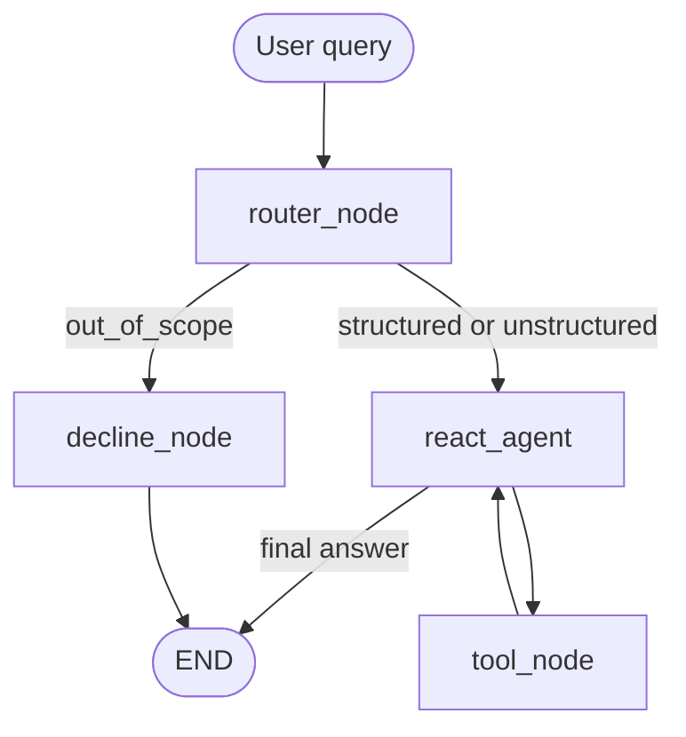

# Bitext Customer Service Data Analyst Agent

Assignment 3 — LangGraph ReAct agent over the [Bitext customer support dataset](https://huggingface.co/datasets/bitext/Bitext-customer-support-llm-chatbot-training-dataset). Tasks 1–3 plus bonuses (Streamlit UI, query recommender) are implemented.

## Prerequisites

- **Python 3.10 or newer** (the code uses `X | None` type syntax from PEP 604). Check with `python3 --version`.
- A **Nebius Token Factory** API key — see [Model](#model) for where to get one.
- **Internet access on first run** to download the dataset (no Hugging Face account or token required — the dataset is public).

## Setup (under 5 minutes)

All commands below run from the **repository root** — the folder that contains `main.py` (not a `bitext-agent/` subfolder).

```bash
# 1. Get the code (skip if you already have it). The folder is named after the repo.
git clone https://github.com/doronreiffman/Reiffman-Assignment3-Bitext-Agent.git
cd Reiffman-Assignment3-Bitext-Agent   # or: cd <whatever you named the clone>

# 2. Create and activate a virtual environment
python3 -m venv .venv
source .venv/bin/activate               # Windows: .venv\Scripts\activate

# 3. Install dependencies
pip install -r requirements.txt

# 4. Add your API key
cp .env.example .env
# Open .env and set NEBIUS_API_KEY=...

# 5. Run
python main.py
```

> On Windows, or if `python3` isn't found, use `python` instead. After the venv is activated, `python` already points at the right interpreter.

First run downloads ~27k rows from Hugging Face and caches them under `data/bitext.parquet`; later runs load from that cache.

## CLI

```bash
python main.py
python main.py --session alice
python main.py --session alice --user alice
```

- `--session` — LangGraph `thread_id`; same value restores conversation after restart (`data/checkpoints.sqlite`).
- `--user` — profile file under `data/profiles/` (defaults to `--session`).

Interactive loop. Type `quit` to exit. The CLI prints:

- Router decision (`structured` / `unstructured` / `out_of_scope`)
- Each tool call and observation
- Final answer

### Session memory (Task 2a)

Follows the course notebook pattern ([agent_memory.ipynb](../agent_memory.ipynb)): compile with a checkpointer, pass only the **new** user message each turn, reuse `thread_id` via `--session`. We use **SqliteSaver** instead of `MemorySaver` so state survives restarts.

Example:

```text
You: How many complaints are in the dataset?
…
You: What about refunds?
```

### User profile (Task 2b)

Distilled facts (name, interests) live in `data/profiles/<user>.json`, separate from chat checkpoints. Updated after each in-scope turn. Ask: *What do you remember about me?*

## Model

**`meta-llama/Llama-3.3-70B-Instruct`** via [Nebius Token Factory](https://api.tokenfactory.nebius.com/v1/).

Create an API key in the Nebius Token Factory console and set it in `.env` as `NEBIUS_API_KEY` (see [Setup](#setup-under-5-minutes)).

Same model for both routing and the ReAct agent. We tried smaller models (Gemma 3 27B) but tool-calling was unreliable — the model would skip filter steps or hallucinate tool names. Llama 3.3 70B handled multi-step chains (filter → count) correctly and is a good cost/quality tradeoff.

## Architecture



1. **Router** — classifies the query before any tools run. Out-of-scope questions get a fixed decline (no general knowledge).
2. **ReAct agent** — Nebius LLM with tools; max **12** agent steps, then a fallback message.
3. **Tools** — composable filters and queries over the dataset.

**Filter state:** `filter_by_*` tools narrow a working view (row IDs in `working_row_ids`, checkpointed per session) so multi-step chains and follow-ups like “show me 3 more” keep the same filter.

## Tools

| Tool | Purpose |
|------|---------|
| `list_categories` | All category names |
| `list_intents` | Intent names, optional category filter |
| `filter_by_category` | Restrict working view to a category |
| `filter_by_intent` | Restrict working view to an intent |
| `reset_filters` | Clear filters |
| `count_rows` | Row count in current view |
| `sample_examples` | Random instruction/response pairs |
| `intent_distribution` | Intent counts in current view |

Multi-step example: `filter_by_intent("get_refund")` → `count_rows()`.

## MCP server (Task 3)

Expose dataset tools via [FastMCP](https://gofastmcp.com/) for any MCP client (Claude Desktop, Cursor, Claude Code, etc.).

### Start the server

```bash
python mcp_server.py
```

Or with the FastMCP CLI:

```bash
fastmcp run mcp_server.py
```

The server uses **stdio** transport (default): the client spawns this process and talks over stdin/stdout. The dataset is loaded once at startup.

**Exposed tools (7):** `list_categories`, `list_intents`, `filter_by_category`, `filter_by_intent`, `count_rows`, `sample_examples`, `intent_distribution`.

Stateful filters work within one MCP session: call `filter_by_intent` then `count_rows` (same as the CLI agent).

### Connect from an MCP client

Most MCP clients share the same `mcpServers` config block — add this server to your client's MCP configuration:

```json
{
  "mcpServers": {
    "bitext-analyst": {
      "command": "/absolute/path/to/repo/.venv/bin/python",
      "args": ["/absolute/path/to/repo/mcp_server.py"]
    }
  }
}
```

Replace `/absolute/path/to/repo` with the absolute path to your repository root (run `pwd` there to get it; on Windows use `.venv\Scripts\python.exe`), then restart/reload the client so it picks up the server. Where this config lives depends on the client:

- **Claude Desktop** — `claude_desktop_config.json` (Settings → Developer → Edit Config)
- **Cursor** — `.cursor/mcp.json` or Settings → MCP
- **Claude Code** — `claude mcp add …` or a project `.mcp.json`
- **Other clients** (Windsurf, etc.) — see the client's MCP docs for where its config lives

### Example: call one tool

In your MCP client's chat (with the server enabled), ask the model to use the `list_categories` tool.

Or test from the terminal:

```bash
python scripts/test_mcp.py
```

Manual chain example:

1. `filter_by_intent` with `intent="get_refund"`
2. `count_rows` → should return `997`

## Bonus A — Streamlit UI

```bash
streamlit run streamlit_app.py
```

- Chat interface with assistant responses
- **Reasoning steps** expander (router, tool calls, observations)
- **Sidebar:** Session ID and User ID (same semantics as CLI `--session` / `--user`)

## Bonus B — Query recommender

Ask: *What should I query next?* (also in the CLI)

1. Agent **suggests** a follow-up query — does **not** run it yet
2. You can refine (*"I'd rather see examples instead"*)
3. Reply **yes** / **go ahead** / **do it** to execute the suggested query

Works in both `streamlit run streamlit_app.py` and `python main.py`.

## Example queries

- What categories exist in the dataset?
- How many refund requests did we get?
- Show me 5 examples of the SHIPPING category.
- Summarize how agents respond to complaint intents.
- What is the distribution of intents in the ACCOUNT category?
- Who is the president of France? (out-of-scope)
